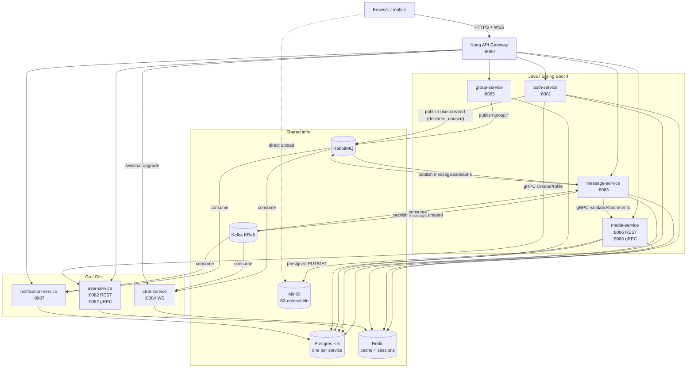
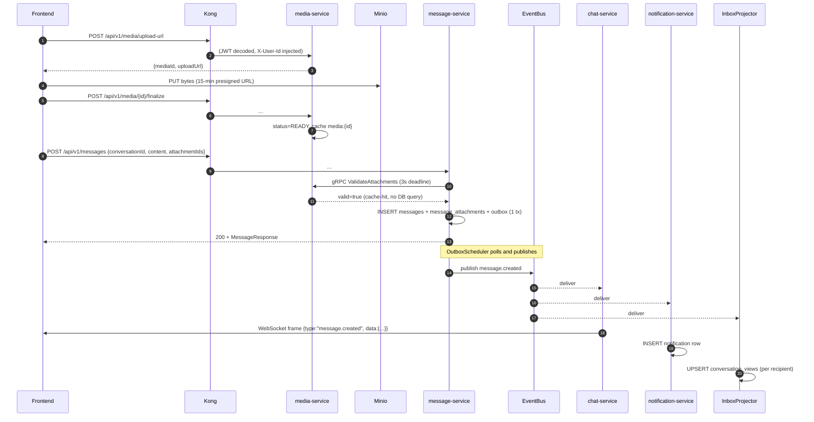
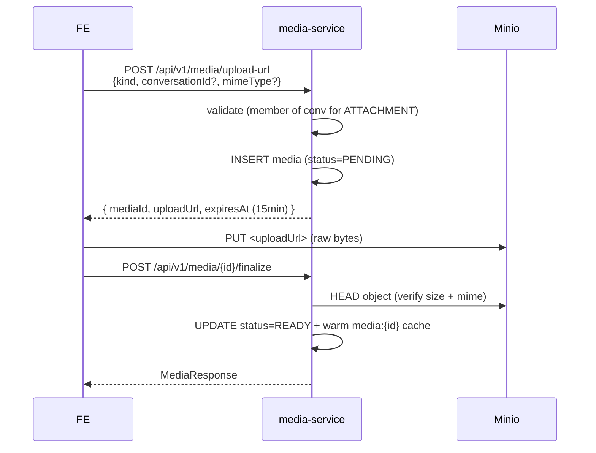
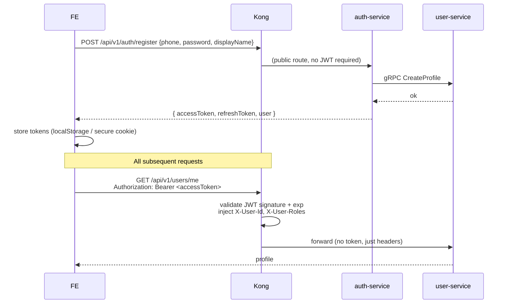
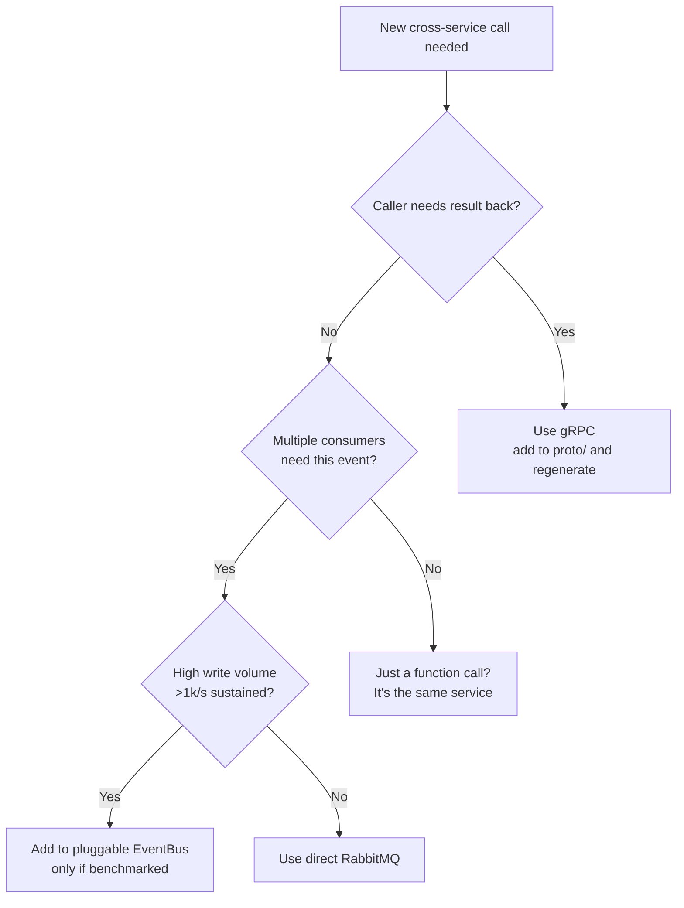

# Zalord Backend — Engineering Reference

> A practical guide for anyone wiring up new code or a frontend against this backend. For the project brief and stage roadmap see `docs/`; this file documents the **system as it actually exists in `main`** right now.

---

## 1. Overarching architecture

Zalord is a chat backend split across **seven microservices** behind an **API gateway**. The split is deliberate — each service owns its own database, deploys independently, and talks to others over exactly three channels:

| Channel | When to use | Example |
|---|---|---|
| **Sync gRPC** | Strong consistency, low volume, the caller needs the result | `auth → user.CreateProfile` after register; `message → media.ValidateAttachments` before persisting a message |
| **Async events (RabbitMQ or Kafka)** | High volume, fire-and-forget, multiple consumers | `message.created` → chat-service (push), notification-service (bell), message-service (CQRS projector) |
| **HTTP via Kong** | Client → server | Frontend hits `http://localhost:8080/api/v1/...` |

Only one chain — `message.created` — uses the **pluggable EventBus** (RabbitMQ ↔ Kafka, toggled with `EVENT_BUS` env). Everything else uses RabbitMQ directly. This is intentional: the abstraction exists for that single benchmark-relevant path, not as a general pattern.

### System map



### Service-to-service contract summary

| Caller | Callee | Channel | Purpose |
|---|---|---|---|
| auth-service | user-service | gRPC `CreateProfile` | Create profile row after register; idempotent |
| message-service | media-service | gRPC `ValidateAttachments` | Reject bogus mediaIds before persisting a message |
| message-service | (all consumers) | `message.created` via EventBus | Drive CQRS inbox, WebSocket fan-out, notifications |
| group-service | message-service, notification-service | `group.*` via RabbitMQ | Project conversation rows; trigger group invitation bells |

### The three load-bearing patterns

1. **Transactional Outbox** in message-service — a message row and an outbox row are written in the same Postgres transaction. The `OutboxScheduler` polls unpublished outbox rows (`FOR UPDATE SKIP LOCKED`) and ships them to the EventBus. Guarantees at-least-once delivery; consumers must dedupe by `messageId`.
2. **Pluggable EventBus** for `message.created` only — both producer (message-service Java) and consumers (chat + notification Go) read `EVENT_BUS=rabbitmq|kafka` and choose backend at startup. All three must match.
3. **Read-through Redis caches** with explicit eviction. `media:{id}`, `conv:{id}:members`, `conv:{id}:type` are caches; `user:sessions:{userId}` is durable state (AOF-backed, never evicted).

### End-to-end: sending a message with an attachment



---

## 2. Per-service reference

All Java services follow the same package layout and return an `ApiResponse<T>` envelope. All Go services follow the same `cmd/internal/pkg` layout. Conventions are detailed in §4.

### 2.1 auth-service (Java)

| | |
|---|---|
| **Port** | 8081 REST |
| **Owns** | postgres-auth: `users`, `roles`, `credentials` |
| **Talks to** | user-service via gRPC; Redis (refresh-token store); RabbitMQ (declared `user.exchange`, unused today) |
| **Used by** | All clients to obtain JWT |

**REST endpoints** (all under `/api/v1/auth`):

| Method | Path | Auth | Purpose |
|---|---|---|---|
| POST | `/register` | none | Create user + credentials; calls user-service to create profile in same flow |
| POST | `/login` | none | Exchange phone+password for `{accessToken, refreshToken}` |
| POST | `/refresh` | none (refresh in body) | Rotate access token |
| POST | `/logout` | JWT | Revoke refresh token |
| POST | `/create-admin` | JWT + role=ADMIN | Bootstrap an admin |

**Why register is sync gRPC** (not an event): a user expects a working profile the instant `/register` returns. Going async would force the frontend to poll. Trade-off: register fails if user-service is down.

### 2.2 user-service (Go)

| | |
|---|---|
| **Ports** | 8082 REST, 9082 gRPC |
| **Owns** | postgres-user: `profiles` (FK-less `user_id` from auth-service) |
| **Exposes** | `UserInternal.CreateProfile` gRPC; REST profile lookup |

**REST endpoints** (`/api/v1/users`):

| Method | Path | Auth | Purpose |
|---|---|---|---|
| GET | `/me` | JWT | Caller's own profile |
| GET | `/by-phone/{phone}` | JWT | Lookup another profile |
| GET | `/` | JWT + ADMIN | Paginated list |

### 2.3 message-service (Java) — the heart of the app

| | |
|---|---|
| **Port** | 8083 REST |
| **Owns** | postgres-message: `conversations`, `conversation_members`, `direct_lookup`, `messages`, `message_attachments`, `conversation_views` (CQRS read model), `outbox_events` |
| **Talks to** | media-service via gRPC; RabbitMQ/Kafka (in + out); Redis (3 caches); group-service indirectly via RabbitMQ |

**REST endpoints**:

| Method | Path | Purpose |
|---|---|---|
| POST | `/api/v1/conversations` | Open/create a DIRECT or GROUP conversation (DIRECT is idempotent on `pair_key`) |
| GET | `/api/v1/conversations` | List caller's conversations |
| GET | `/api/v1/conversations/{id}` | Get one (members only) |
| POST | `/api/v1/messages` | Send a message (content and/or attachmentIds — at least one required) |
| GET | `/api/v1/messages?conversationId=...&page=...&size=...` | History, newest first |
| GET | `/api/v1/inbox` | CQRS read model: conversations sorted by recency with unread counts + preview |
| POST | `/api/v1/inbox/{conversationId}/read` | Reset unread to 0 |

**Internal components**:
- `OutboxScheduler` — polls `outbox_events` every 3 s, ships to EventBus, marks `published_at`.
- `InboxProjector` — consumes `message.created`, upserts `conversation_views`. Uses `ConversationTypeCache` to avoid one DB query per event.
- `GroupEventConsumer` — consumes `group.*`, projects `conversations` + `conversation_members` rows (group.id reused as conversation.id), syncs `ConversationMembersCache`.

### 2.4 group-service (Java)

| | |
|---|---|
| **Port** | 8085 REST |
| **Owns** | postgres-group: `groups`, `group_members` |
| **Publishes** | `group.exchange` topic with routing keys `group.created`, `group.updated`, `group.member.added`, `group.member.removed` |

**REST endpoints** (`/api/v1/groups`):

| Method | Path | Role | Purpose |
|---|---|---|---|
| POST | `/` | any | Create group (caller becomes OWNER) |
| GET | `/` | any | List caller's groups |
| GET | `/{id}` | member | Group details |
| PATCH | `/{id}` | OWNER/ADMIN | Update name/avatar |
| POST | `/{id}/members` | OWNER/ADMIN | Add member |
| DELETE | `/{id}/members/{userId}` | OWNER/ADMIN or self | Remove member |
| POST | `/{id}/leave` | any member | Shortcut for self-remove |

### 2.5 chat-service (Go)

| | |
|---|---|
| **Port** | 8084 WS + HTTP |
| **State** | In-memory session registry (multi-instance fan-out via Redis pub/sub is planned — see roadmap) |
| **Consumes** | `message.created` via EventBus |
| **Pushes** | WebSocket frames to online recipients |

**WebSocket endpoint**: `GET /ws/chat?token=<jwt>` (browsers can't set custom headers on WS upgrade, so JWT is also accepted as a query param). After upgrade, the connection is registered under the user's ID; on each incoming `message.created` event the handler iterates `recipientIds`, looks up sessions, and sends:

```json
{ "type": "message.created", "data": { "messageId": "...", "conversationId": "...", "senderId": "...", "content": "...", "attachmentIds": [...], "createdAt": "..." } }
```

Slow consumers (full send buffer) get **dropped frames** — recovery is the client's job via REST history. This is deliberate: blocking the fan-out for one slow client would freeze delivery for everyone else.

### 2.6 media-service (Java)

| | |
|---|---|
| **Ports** | 8086 REST, 9086 gRPC |
| **Owns** | postgres-media: `media` table (metadata only; bytes are in MinIO buckets `avatars` and `attachments`) |
| **Exposes** | `MediaInternal.ValidateAttachments` gRPC |

**Two-step presigned URL flow** (the same shape applies to both avatar and attachment kinds):



**REST endpoints** (`/api/v1/media`):

| Method | Path | Purpose |
|---|---|---|
| POST | `/upload-url` | Issue presigned PUT URL |
| POST | `/{id}/finalize` | Confirm upload and flip status to READY |
| GET | `/{id}` | Metadata (no URL) |
| GET | `/{id}/url` | Presigned GET URL (authz: owner OR conversation member) |
| DELETE | `/{id}` | Soft delete (status=DELETED) |

**gRPC `ValidateAttachments`** — called sync from message-service when a message has `attachmentIds`. For each id, rejects on `NOT_FOUND`, `NOT_OWNED`, `WRONG_CONVERSATION`, `NOT_READY`, `DELETED`. Returns full list of offenders so the message-service can build a useful 400.

### 2.7 notification-service (Go)

| | |
|---|---|
| **Port** | 8087 |
| **Owns** | postgres-notification: `notifications` (per-user feed) |
| **Consumes** | `message.created` via EventBus; `group.*` via raw RabbitMQ (dual paths — only the message chain is benchmarked) |

**REST endpoints** (`/api/v1/notifications`):

| Method | Path | Purpose |
|---|---|---|
| GET | `/` | Paginated notification feed |
| GET | `/unread-count` | Single integer for the bell badge |
| POST | `/{id}/read` | Mark one as read |
| POST | `/read-all` | Mark all as read |

**Body computation** for `NEW_MESSAGE`: if `content` is non-blank, use it (truncated to 200 chars); otherwise fall back to `📎 N tệp đính kèm` so attachment-only messages still surface meaningfully.

### 2.8 Infrastructure containers

| Container | Image | Used by | Init |
|---|---|---|---|
| `postgres-{auth,user,message,group,media,notification}` | `postgres:16-alpine` | each respective service (no cross-service queries) | `infra/postgres/init-*.sql` |
| `redis` | `redis:7-alpine` | shared cache + session registry | `infra/redis/redis.conf` (AOF on, no eviction) |
| `rabbitmq` | `rabbitmq:3.13-management-alpine` | default async bus; declared by apps at startup | none |
| `kafka` | `apache/kafka:3.9.0` | swapped in for `message.created` when `EVENT_BUS=kafka` | `kafka-init` one-shot runs `infra/kafka/create-topics.sh` |
| `minio` | `minio/minio:latest` | object storage | `minio-init` one-shot runs `infra/minio/create-buckets.sh` |
| `kong` | `kong:3.7` | API gateway (DB-less, declarative) | `infra/kong/kong.yml` |
| `swagger-ui` | `swaggerapi/swagger-ui:latest` | dev-only aggregated docs at `/docs` | none |

---

## 3. Frontend integration

### 3.1 Single entry point: Kong at `http://localhost:8080`

The frontend should **never** call services directly. Kong validates JWT signature + expiry, decodes the claims, and injects `X-User-Id` and `X-User-Roles` headers before forwarding. Services trust those headers absolutely — bypassing Kong would let any client claim any identity.

### 3.2 Auth flow



**Token rotation**: when an API returns 401, call `POST /api/v1/auth/refresh` with the refresh token. On 401 from refresh too → redirect to login.

### 3.3 Response envelope

Every Java service wraps its response in `ApiResponse<T>`:

```json
{
  "status": "success",
  "message": "Message sent",
  "data": { "id": "...", "content": "...", "attachmentIds": [...] },
  "errorCode": null,
  "timestamp": "2026-06-21T06:45:00Z"
}
```

On error:

```json
{
  "status": "error",
  "message": "Invalid attachments: <uuid> (NOT_OWNED)",
  "data": null,
  "errorCode": "INVALID_REQUEST",
  "timestamp": "..."
}
```

Go services return raw JSON (no envelope) — handle both shapes.

### 3.4 WebSocket connection

```javascript
const ws = new WebSocket(`ws://localhost:8080/ws/chat?token=${accessToken}`);
ws.onmessage = (e) => {
  const frame = JSON.parse(e.data);
  if (frame.type === 'message.created') {
    const { messageId, conversationId, senderId, content, attachmentIds } = frame.data;
    // render in chat UI
  }
};
ws.onclose = () => /* exponential backoff reconnect */;
```

On reconnect, **always re-fetch missed history** via `GET /api/v1/messages?conversationId=...&page=1`. WS does not replay dropped frames — they were dropped on purpose to keep fan-out fast for everyone else.

### 3.5 Media attachment flow (frontend perspective)

1. User picks files → for each, `POST /api/v1/media/upload-url` with `kind=ATTACHMENT` and the current `conversationId`.
2. `PUT` raw bytes to the returned `uploadUrl` (direct browser → MinIO; **no proxying through backend**).
3. `POST /api/v1/media/{id}/finalize` to flip status to READY.
4. Now send the message: `POST /api/v1/messages` with `attachmentIds: [...]`.
5. Recipients receive the message frame; their UI fetches a download URL per attachment via `GET /api/v1/media/{id}/url`.

The `MINIO_PUBLIC_ENDPOINT` env in dev is `http://localhost:9000`. In production, this should be a proper URL behind TLS that the browser can reach.

### 3.6 Headers and pagination

- **Auth header**: `Authorization: Bearer <accessToken>` on every authenticated request.
- **CORS**: Kong is configured to allow the frontend origin in `infra/kong/kong.yml`. Update there if hosting changes.
- **Pagination**: query params `?page=1&size=20` (Java services); the response includes a `PageResponse` with `items`, `page`, `size`, `total`.

---

## 4. Adding a new feature: conventions

When a new requirement comes in, walk through these decisions in order.

### 4.1 Pick the right communication pattern



**Default to RabbitMQ** for async. Only promote a channel to the EventBus interface if you actually plan to compare backends — the abstraction has a cost.

### 4.2 Database changes

- Add your service's own Postgres if you don't have one; never share a DB with another service.
- Schema lives in `infra/postgres/init-<service>.sql` (applied **only on first volume init**). For existing deployments, apply manually with `make psql` then commit the migration SQL to the init script for fresh setups. Long-term, introduce Flyway or similar.
- **No FKs across services.** A `user_id` in message-service is a UUID, not a foreign key into auth-service's `users` table.
- Indexes go in the same init script. If a query is slow, add the index; don't bolt on a cache as a first response.

### 4.3 Outbox for any cross-service event

If your write needs to publish an event, do **not** wrap the DB write and the broker publish in a single try/catch. Use the same pattern as `message-service`:

1. In one Postgres transaction, INSERT your business row and INSERT into `outbox_events`.
2. A scheduler polls `outbox_events` with `FOR UPDATE SKIP LOCKED`, publishes to the broker, sets `published_at`.

This guarantees at-least-once delivery. Make your consumers idempotent (dedupe by event id).

### 4.4 Caching — only when justified

A cache is a correctness liability. Before adding one, answer:

1. **What's the cache miss path?** It must be the existing DB query, untouched. The cache layer wraps it.
2. **When is it invalidated?** Write down every code path that mutates the underlying data. Each one needs an `evict()` call. If you can't enumerate them, don't cache.
3. **Is the cached field immutable?** (e.g. `conv:{id}:type` — type never changes.) Those caches can skip TTL.
4. **What's the failure mode?** Redis hiccups must not fail the request. Wrap reads/writes in try/catch and log a warning.

Cache keys live in `*Cache.java` (Java) or `pkg/cache/` (Go). Reuse `StringRedisTemplate` / `redis.NewClient` — no new Redis libraries.

### 4.5 Java service conventions

Package layout (`backend/<svc>/src/main/java/zalord/<svc>_service/`):

```
controller/    — @RestController, thin
service/       — interface + impl, business logic
repository/    — Spring Data JPA
model/         — JPA entities
dto/
  request/     — @Valid request bodies
  response/    — response records
  event/       — events published to broker
exception/     — custom exceptions + GlobalExceptionHandler
config/        — Spring @Configuration
grpc/          — gRPC client and/or server beans
cache/         — Redis cache wrappers
worker/        — schedulers, projectors, consumers
eventbus/      — only in message-service today
```

Required:
- Every endpoint returns `ApiResponse<T>` — wrap your data in `ApiResponse.ok(data, "message")` or let `GlobalExceptionHandler` build the error envelope.
- Custom exceptions extend `RuntimeException` and get a handler in `GlobalExceptionHandler` with a clear `errorCode`.
- Trust `X-User-Id` (`UUID.fromString(request.getHeader("X-User-Id"))`) — Kong validated the JWT, you don't need to.
- Use `@Transactional` on service methods that touch multiple tables or write to outbox. Be aware that lambda-style listener subscriptions bypass Spring's AOP proxy (see the `InboxProjector` self-injection pattern).

### 4.6 Go service conventions

Layout (`backend/<svc>/`):

```
cmd/server/main.go           — entry point, dependency wiring, graceful shutdown
internal/
  config/                    — env var loading
  database/                  — pgx pool
  handler/                   — Gin handlers
  middleware/                — Identity(), RequireRole(...)
  repository/                — data access
  service/                   — business logic
  grpc/                      — gRPC server (if any)
db/sqlc/                     — sqlc-generated query code (do not hand-edit)
pkg/
  logger/                    — zap singleton
  mq/                        — RabbitMQ wrapper (PermanentError type for poison messages)
  eventbus/                  — pluggable Rabbit/Kafka (chat + notification only)
proto/                       — proto files + generated stubs
docs/                        — swagger-generated, regen with swag init
```

Required:
- Use `signal.NotifyContext` for graceful shutdown; pass `ctx` into every long-running goroutine.
- All consumers return `error` — wrap permanent failures in `&mq.PermanentError{}` so they don't get requeued forever.
- Use `zap` via `logger.Log` — never `fmt.Println`.
- `Identity()` middleware reads `X-User-Id` from the request and puts it in `c.Set("userId", uuid)`. Handlers retrieve with `c.MustGet("userId").(uuid.UUID)`.

### 4.7 Adding a new gRPC contract

1. Write the proto under `proto/<service>/v1/<name>.proto`. Include both `option go_package` and `option java_package`.
2. Copy the file into the server's source root (`backend/<svc>/src/main/proto/...` for Java, `backend/<svc>/proto/...` for Go) and into every client's source root.
3. Java: `protobuf-maven-plugin` regenerates on build (must use jammy not alpine — `protoc` is glibc-linked).
4. Go: `protoc --go_out --go-grpc_out` (or use `buf generate` if added later).
5. Pick an internal port in the 9000s (different from the public REST port).
6. Wire the env vars in `docker-compose.yml`: server exposes `<SVC>_GRPC_PORT`, client gets `ZALORD_<SVC>_SERVICE_GRPC_TARGET=<svc>:<port>`.
7. Add `depends_on: <svc>: condition: service_healthy` on the client side so startup ordering is sane.

### 4.8 Adding a new async event

1. Decide producer service. Add an `<Event>.java` record (Java) or struct (Go) under `dto/event/` or `internal/event/`.
2. Producer publishes via outbox (Java) or directly via `EventPublisher` interface (Java) / `mq.Publisher` (Go).
3. Consumer subscribes by routing key. Topic exchange + routing key pattern: `<noun>.<verb>` e.g. `message.created`, `group.member.removed`.
4. If you switch the path to the pluggable EventBus, **all** consumers of that topic must be updated to use the `EventConsumer` interface — RabbitMQ and Kafka are not mixed for one topic.
5. Consumers must be idempotent. Dedupe by the event's primary id field.

### 4.9 Kong route for a new endpoint

Edit `infra/kong/kong.yml`:

```yaml
- name: my-new-route
  service: my-svc
  paths: ["/api/v1/my-resource"]
  strip_path: false
  plugins:
    - name: jwt
    - name: pre-function
      config: { access: [<the standard identity injection lua>] }
```

Restart Kong: `docker compose restart kong`. No DB migration — Kong is fully declarative.

### 4.10 Testing locally

```bash
make dev           # bring stack up
make logs SERVICE=message-service
make psql PG=message
make redis-cli
make kafka-topics
make smoke         # end-to-end smoke test
```

For your new endpoint, add a happy-path + at least one negative test to `scripts/sprint1-smoke.sh`. The smoke script is the closest thing to a regression suite right now.

### 4.11 What NOT to do

- ❌ Don't cross-query DBs (`SELECT … FROM auth.users JOIN message.conversations` — this won't even connect, the containers are isolated, and that's the point).
- ❌ Don't catch a Redis error and fail the request — log + fall through to DB.
- ❌ Don't add a new dependency just for prettier code. Spring Boot 4 and Gin already include what you need.
- ❌ Don't write docs explaining what the code does — write code whose name explains itself. Docs are for invariants, trade-offs, and the *why*.

---

## Where to look next

- `docs/architecture.md` — sprint-level architecture intent
- `docs/services.md` — original per-service responsibilities
- `docs/patterns.md` — outbox, sequence_id, presigned URL deep dives
- `Makefile` — every operational command
- `infra/kong/kong.yml` — gateway is the source of truth for what's exposed
- `proto/` — every cross-service contract that needs versioning
