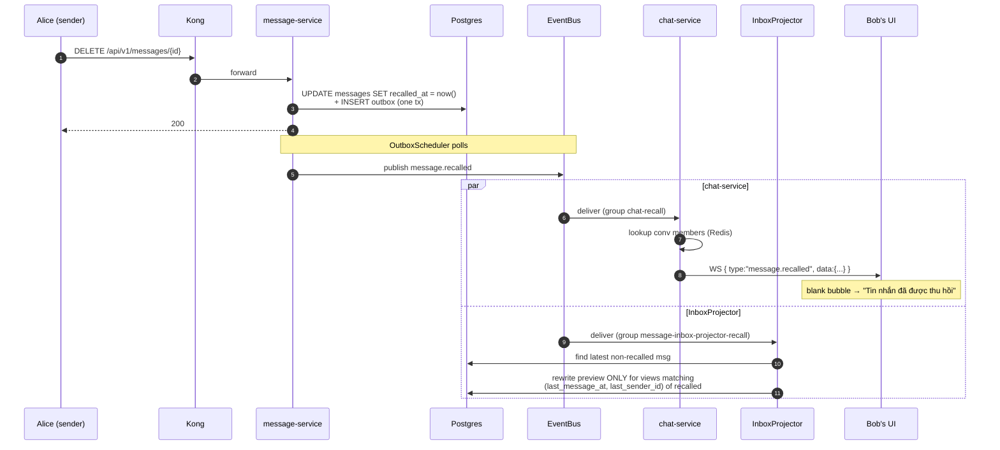
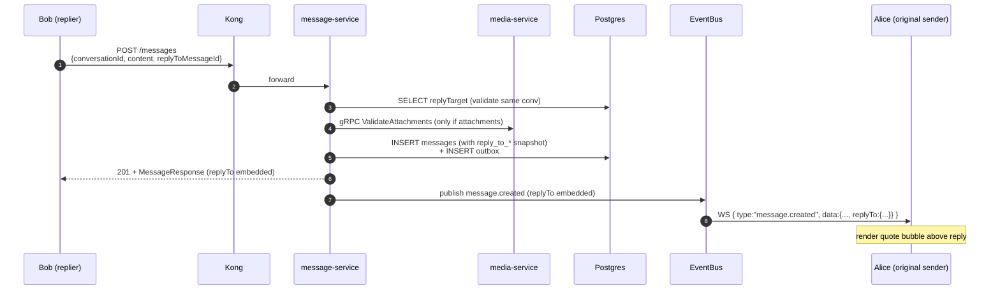

# Recall ("thu hồi") + Reply ("trả lời")

Two messaging features that round out the chat UX. Both touch the same paths (`POST /messages`, history, inbox preview, WS fan-out) but make different design choices because their constraints differ.

---

## 1. What we built

| Feature | What the user sees | Persistence |
|---|---|---|
| **Recall** | Tap your own message → "Thu hồi". Everyone in the conversation sees "Tin nhắn đã được thu hồi" in place of the body; the bubble row stays in the timeline. | `messages.recalled_at` (soft delete) + `message.recalled` event |
| **Reply** | Long-press a message → "Reply". The composed message renders with a quote preview inlined above the body. The quote remains stable even if the original is later recalled. | `messages.reply_to_*` columns (snapshot at send time) |

---

## 2. Design rationale

### 2.1 Recall: soft delete, with an event

Two things had to be true:
- **Other clients must update instantly.** → publish `message.recalled` through the existing Transactional Outbox path (same shape as `message.created`, `message.read`).
- **Pagination + reply-quote snapshots must not break.** → leave the row in `messages`; only set `recalled_at` and blank the body in the response layer.

The row stays because:
- `GET /api/v1/messages?page=...` orders by `created_at`. Deleting the row would cause page boundaries to shift under the client.
- A reply that quoted this message snapshotted its preview into `reply_to_preview` — the snapshot is independent of the original now, but referential integrity (`reply_to_message_id` → `messages.id`) would still want the row to exist for future debug queries.

**No time limit enforced in v1.** Zalo's "thu hồi" is bounded to 24h. We left this off to keep the code minimal; the rule is one line in the service if needed: `if (Duration.between(msg.getCreatedAt(), Instant.now()).toHours() >= 24) throw …`.

**Inbox preview after recall.** Tricky case: a user's inbox preview shows the recalled message. We need to roll it back. The projection:

1. Listens to `message.recalled` (separate consumer group `message-inbox-projector-recall` so it can't block `message.created`).
2. Looks up the recalled message's `created_at` + `sender_id`.
3. Finds the next non-recalled message in the conversation (`findFirstByConversationIdAndRecalledAtIsNullOrderByCreatedAtDesc`).
4. Single targeted `UPDATE conversation_views SET preview = ?, last_message_at = ?, last_sender_id = ? WHERE conv_id = ? AND last_message_at = ? AND last_sender_id = ?` — only rows whose current preview IS the recalled one get rewritten. Other rows (newer messages already replaced the preview) stay untouched.

If the recalled message was the conversation's ONLY message, the preview falls back to `"Tin nhắn đã được thu hồi"`.

**Recall does NOT reset unread count.** People who already saw the message can't un-see it; the notification has already been delivered.

### 2.2 Reply: denormalized snapshot, no extra event

Two design choices:

**Snapshot vs. resolve-at-read.** We embed `{ messageId, senderId, preview }` directly into the reply message's row (`reply_to_*` columns). Alternatives considered:
- Store only `reply_to_message_id`, join on read. **Rejected** — needs an extra DB lookup on every `GET /messages` page (200 messages × 1 join per row), and the join has to be careful not to expose recalled content.
- Resolve at WS push time. **Rejected** — same problem, plus `message.created` event would need an extra DB roundtrip in `OutboxScheduler`.

Snapshotting trades a few hundred bytes per reply for zero extra reads on the hot path. The snapshot is final — even if the original is recalled, the snippet shown in the quote stays. This is actually preferable UX (Telegram does this, Zalo replaces with placeholder; we picked Telegram's behavior because it preserves conversational context).

**No new event.** Reply rides on the existing `message.created` event — we just added a nested `replyTo: { messageId, senderId, preview }` field. chat-service auto-forwards it via JSON marshalling, no consumer-side change needed.

**Validation rules.**
- `replyToMessageId` must exist.
- It must be in the SAME conversation as the reply (cross-conversation reply rejected with 400).
- Recalled messages CAN be replied to. The snapshot is taken from current content; if recalled, `snapshotPreview()` returns `"Tin nhắn đã được thu hồi"` — the reply quote shows the placeholder, which is what the user would see in the chat anyway.

---

## 3. API reference

### 3.1 Send (extended)

```http
POST /api/v1/messages
Authorization: Bearer <jwt>
Content-Type: application/json

{
  "conversationId": "...",
  "content": "yes I see it",            // optional (must have content OR attachments)
  "attachmentIds": ["...", "..."],      // optional, max 10
  "replyToMessageId": "..."             // optional, must be in same conv
}
```

**Response** (201 Created):

```json
{
  "status": "success",
  "data": {
    "id": "dbfb5e17-...",
    "conversationId": "4c1298a3-...",
    "senderId": "...",
    "content": "yes I see it",
    "attachmentIds": [],
    "createdAt": "...",
    "recalledAt": null,
    "replyTo": {
      "messageId": "ec7c140b-...",
      "senderId": "...",
      "preview": "hello world"
    }
  }
}
```

`replyTo` is null when the message isn't a reply.

### 3.2 Recall

```http
DELETE /api/v1/messages/{messageId}
Authorization: Bearer <jwt>
```

- `200 OK` — recalled (or already recalled — idempotent)
- `403 FORBIDDEN` — caller is not the sender
- `400 INVALID_REQUEST` — message id doesn't exist

**Triggers** `message.recalled` event → chat-service pushes WS frame to all members → InboxProjector rewrites preview if needed.

### 3.3 History (extended fields)

`GET /api/v1/messages?conversationId=…` now returns each row with:
- `recalledAt`: ISO instant, non-null = recalled
- `content`: blanked (`""`) when recalled
- `attachmentIds`: empty array when recalled
- `replyTo`: nested snippet, null for non-replies

Clients should:
- Render `recalledAt != null` as the localized "Tin nhắn đã được thu hồi" placeholder.
- Render `replyTo` as an inline quote bubble. Tapping it can scroll to the original (look up locally by `messageId`); if the original is recalled in your local cache, optionally style the quote as muted.

---

## 4. WebSocket frames

Added one frame type and extended another:

### 4.1 `message.created` (extended — new field `replyTo`)

```json
{
  "type": "message.created",
  "data": {
    "messageId": "...",
    "conversationId": "...",
    "senderId": "...",
    "recipientIds": [...],
    "content": "...",
    "attachmentIds": [...],
    "createdAt": "...",
    "replyTo": {                  // ← NEW, omitted when null
      "messageId": "...",
      "senderId": "...",
      "preview": "..."
    }
  }
}
```

### 4.2 `message.recalled` (new)

```json
{
  "type": "message.recalled",
  "data": {
    "messageId": "...",
    "conversationId": "...",
    "senderId": "...",
    "recalledAt": "..."
  }
}
```

Sent to **all members** of the conversation (including the sender's other devices, so the recall syncs across tabs).

---

## 5. Sequence diagrams

### 5.1 Recall



### 5.2 Reply



---

## 6. Frontend integration

### 6.1 Sending a reply

```typescript
async function sendReply(conversationId: string, content: string, replyToMessageId: string) {
  const r = await fetch("/api/v1/messages", {
    method: "POST",
    headers: { "Authorization": `Bearer ${jwt}`, "Content-Type": "application/json" },
    body: JSON.stringify({ conversationId, content, replyToMessageId })
  });
  return (await r.json()).data;
}
```

The response includes `replyTo` so you can render the quote immediately without waiting for the WS echo.

### 6.2 Rendering replies in the timeline

For each message in your local cache:

```typescript
function MessageBubble({ msg }) {
  if (msg.recalledAt) {
    return <em className="muted">Tin nhắn đã được thu hồi</em>;
  }
  return (
    <div>
      {msg.replyTo && <QuoteBubble snippet={msg.replyTo} />}
      <div>{msg.content}</div>
      {msg.attachmentIds.map(id => <Attachment mediaId={id} key={id} />)}
    </div>
  );
}

function QuoteBubble({ snippet }) {
  // Optionally check local cache: if original is recalled, mute the styling
  const original = localCache.get(snippet.messageId);
  const isOriginalRecalled = original?.recalledAt != null;
  return (
    <div className={`quote ${isOriginalRecalled ? "quote-recalled" : ""}`}
         onClick={() => scrollToMessage(snippet.messageId)}>
      <div className="quote-sender">{lookupName(snippet.senderId)}</div>
      <div className="quote-preview">{snippet.preview}</div>
    </div>
  );
}
```

### 6.3 Recalling a message

```typescript
async function recall(messageId: string) {
  const r = await fetch(`/api/v1/messages/${messageId}`, {
    method: "DELETE",
    headers: { "Authorization": `Bearer ${jwt}` }
  });
  // 200 = recalled (or already was). 403 = not your message.
  return r.ok;
}
```

UI: show "Thu hồi" in the long-press menu only when `msg.senderId === currentUserId` AND `!msg.recalledAt`.

### 6.4 Handling incoming `message.recalled`

```typescript
function onMessageRecalled(data) {
  const { messageId, conversationId, recalledAt } = data;
  // Patch local message cache
  const m = messages.get(messageId);
  if (m) {
    m.recalledAt = recalledAt;
    m.content = "";
    m.attachmentIds = [];
    rerenderMessage(messageId);
  }
  // If this was the conv's last visible message, the inbox preview may be
  // stale — but the server has already updated it; refetch when convenient
  // (e.g. when user opens the inbox tab).
}
```

### 6.5 Edge cases

- **Reply to a recalled message.** Server allows it; the `preview` will be `"Tin nhắn đã được thu hồi"`. Render the quote as-is.
- **Reply across conversations.** Server returns 400. Should never happen with correct UI — the reply button only appears for in-conv messages.
- **Recall an already-recalled message.** Server returns 200 (idempotent), no event re-published. UI can no-op.
- **You missed the `message.recalled` frame while offline.** Next `GET /messages` will have `recalledAt` set; the UI hydrates correctly.

---

## 7. Backend changes (file map)

### message-service (Java)
| Path | Change |
|---|---|
| `infra/postgres/init-message.sql` | + `recalled_at`, `reply_to_message_id`, `reply_to_sender_id`, `reply_to_preview` columns; partial index on `reply_to_message_id` |
| `model/Message.java` | + 4 fields |
| `dto/request/SendMessageRequest.java` | + `replyToMessageId` |
| `dto/response/MessageResponse.java` | + `recalledAt`, `replyTo` |
| `dto/response/ReplyToSnippet.java` | NEW record |
| `dto/event/MessageCreatedEvent.java` | + nested `ReplyToSnippet` |
| `dto/event/MessageRecalledEvent.java` | NEW record |
| `repository/MessageRepository.java` | + `findFirstByConversationIdAndRecalledAtIsNullOrderByCreatedAtDesc` |
| `repository/ConversationViewRepository.java` | + `rewritePreviewForRecalled` |
| `service/IMessageService.java` | + `recall(...)` |
| `service/impl/MessageServiceImpl.java` | + reply validation + snapshot; + `recall(...)`; + `snapshotPreview` helper |
| `controller/MessageController.java` | + `DELETE /{messageId}` |
| `exception/ForbiddenException.java` + `GlobalExceptionHandler.java` | + 403 handler |
| `worker/InboxProjector.java` | + subscribes `message.recalled`; + `projectRecall(...)` |
| `config/RabbitMQConfig.java` | + `MESSAGE_RECALLED_ROUTING_KEY` |

### chat-service (Go)
| Path | Change |
|---|---|
| `internal/events/payload.go` | + `ReplyToSnippet`, `MessageRecalledEvent`; + `ReplyTo` field on `MessageCreatedEvent` |
| `internal/events/recall_fanout.go` | NEW consumer |
| `internal/handler/inbound.go` | + `OutMessageRecalled` constant |
| `cmd/server/main.go` | + subscribe `message.recalled` (group `chat-recall`) |

### infra
| Path | Change |
|---|---|
| `infra/kafka/create-topics.sh` | + `message.recalled` topic |

### Test
| Path | Purpose |
|---|---|
| `scripts/test-recall-reply.py` | E2E happy + negative paths for both features |

---

## 8. What we chose NOT to do

| Idea | Why we skipped |
|---|---|
| Per-message edit history ("đã chỉnh sửa") | Out of scope; recall is the only mutation we support |
| Time-limited recall (24h cap) | One-line addition if the panel asks for it — left out to keep tests deterministic |
| Recall notification ("Alice đã thu hồi 1 tin nhắn") | We push the WS frame; rendering a system message is the UI's call. Server doesn't add a row |
| Reply to attachments without content quote | Snapshot uses `"📎 Tệp đính kèm"` when the quoted message has no text — good enough; can improve later |
| Threaded replies (Slack-style) | We have linear replies only (one-level quote). Threading would need a `thread_root_id` schema change + UI redesign |

---

## 9. Defense talking points

> "Recall and reply both extend the same endpoint family but make opposite trade-offs on persistence vs. event flow. Recall is small-payload state mutation (just `recalled_at`) but needs an event for live propagation and inbox-preview rollback. Reply is high-payload state (the snapshot snippet) but needs no new event — it piggybacks on `message.created` because the WS consumer was already going to fan that out. Picking what does and doesn't get its own event is the design move: every new event has a queue, a consumer group, a failure mode, and a benchmarking footprint, so we add one only when the existing channel literally cannot carry the change."

If pushed on "why snapshot the reply preview instead of looking it up": **denormalization saves a join on the hot path** (`GET /messages` returns up to 200 rows; each would need a self-join). The snapshot is also the right semantic — a quote is supposed to capture what was said *at the time*, not what the original looks like now.
