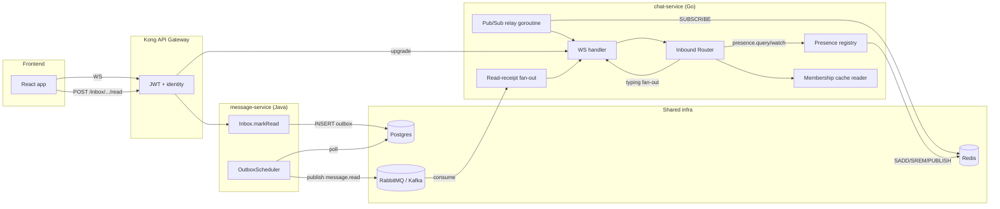
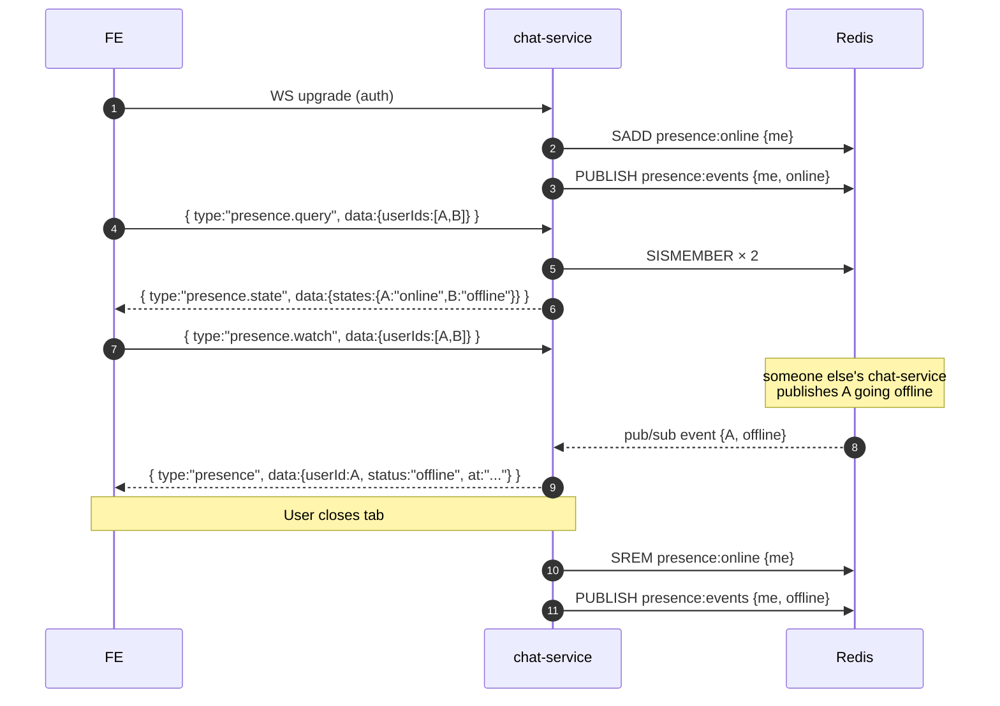
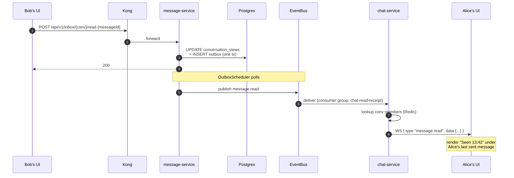

# Realtime Presence Features — Typing, Online/Offline, Seen

> **Audience.** Two readers: (1) the thesis defense panel — focus on §1 / §2 for the architectural story; (2) frontend developers integrating these — focus on §3 onwards. Backend implementation reference is §4.

---

## 1. What we built and why

The chat now supports three realtime affordances that make conversation feel "live":

| Feature | What the user sees | Where the source of truth lives |
|---|---|---|
| **Typing indicator** | "Alice is typing…" appears under the message box; disappears when she stops or after 5 s of silence | Nowhere — ephemeral WS-only signal, never touches DB or broker |
| **Online / Offline** | Green dot next to the user's avatar; "Last seen 2 min ago" copy | Redis (`presence:online` SET + per-user TTL heartbeat) |
| **Seen (read receipts)** | "Seen 13:42" under the last message you sent that the other party has read | Postgres `conversation_views.last_read_message_id` (+ `last_read_at`) |

These three features fall into three different architectural tiers — picking the right tier per feature is the design contribution.

### Why three tiers and not one

A naive design would push everything through the same broker as `message.created`. That would be **wrong** for two reasons:

1. **Typing fires every keystroke.** At 50 chars/sec across 10 K users that's 500 K events/sec — orders of magnitude more than chat messages. Persisting any of that is a waste, and even publishing to a broker introduces serialization + ack overhead.
2. **Online/Offline can never be "missed".** If a user disconnects and the broker is briefly down, we'd show them as online forever. Periodic heartbeats with TTL is the only correct design — and that's a Redis-shaped problem, not a queue-shaped problem.
3. **Seen must survive a server restart.** It's read by the inbox page on every page load. The other two don't need persistence; this one does.

So we sorted by **persistence requirement** and **fan-out volume**, and each feature ended up in its own tier:

```
              ┌────────────────────┬──────────────────┬─────────────────┐
              │ Typing             │ Online/Offline   │ Seen            │
──────────────┼────────────────────┼──────────────────┼─────────────────┤
 Channel      │ WS in → WS out     │ Redis + WS       │ REST + outbox + │
              │ (one hop)          │ pub/sub          │ event + WS      │
 Storage      │ None               │ Redis (TTL)      │ Postgres        │
 Persistence  │ Ephemeral          │ Best-effort      │ Durable         │
 Rate         │ Very high          │ Low (transitions)│ Low             │
 Cross-svc?   │ No                 │ Yes (pub/sub)    │ Yes (outbox)    │
```

### System view



---

## 2. Architectural rationale (for the defense panel)

### 2.1 Typing: pure WebSocket pipe

The simplest possible design wins here. Both ends of typing are already on a WebSocket connection to chat-service, so chat-service just forwards the frame to the other conversation members. No event needs to leave the service.

**Trade-off accepted.** In a multi-instance chat-service deployment, two users on different instances wouldn't see each other's typing — there's no cross-instance bus for it. We deliberately did not solve this for v1 because:
- The chat-service is single-instance in our current target deployment (one 8 GB VPS).
- The fix when we scale is trivial: drop a Redis Pub/Sub `typing:{convId}` channel beside the presence one we already have.

**Membership check.** Even typing is authorized — chat-service confirms the sender is a member of the conversation before fanning out, using the `conv:{id}:members` Redis cache that message-service already maintains. Without this, any client could spam typing into any conv.

### 2.2 Online/Offline: Redis as source of truth, Pub/Sub for cross-instance

Two-piece design:

1. **State store.** `SADD presence:online {userId}` on first WS connect, `SREM` on last disconnect. Plus `SETEX presence:hb:{userId} 90 "1"` refreshed every 30 s — if an instance crashes, the heartbeat expires and a sweep job (or a future on-demand check) reconciles.
2. **Cross-instance fan-out.** `PUBLISH presence:events {userId, status}` on every transition. A goroutine in every chat-service instance `SUBSCRIBE`s to that channel and pushes transitions to local clients that asked to watch that specific user.

**Why per-user watch (not "broadcast all transitions").** With 10 K online users, transitions could exceed several per second. Most clients only care about the ~50 users in their conversation list. So clients explicitly `presence.watch` the users they're rendering; we keep a reverse index `watchee → watching clients` per instance.

**Trade-off accepted.** When a user has 2 tabs open and closes 1, the local instance's "last connection" check briefly broadcasts offline → online (the second tab's heartbeat re-marks them). For a presence indicator this flicker is acceptable; a chat app is not a battle-tested IM platform. The fix when we care: cluster-wide reference counting (`HINCRBY presence:refs {userId} ±1`). Not done in v1 to keep the moving parts low.

### 2.3 Seen: piggybacks on the Transactional Outbox

The existing `POST /api/v1/inbox/{conversationId}/read` endpoint already resets `unread_count`. We extended it to **also** persist `last_read_message_id` + `last_read_at` and to write a `message.read` row into the same `outbox_events` table that the message-creation flow uses.

This means:
- **Atomicity** — the read state and the event are in the same Postgres transaction. No way to update the DB but lose the event, or publish an event that never landed in the DB.
- **At-least-once delivery** — same outbox scheduler, same backend (RabbitMQ or Kafka via the existing pluggable bus), same dedup story.
- **Zero new infrastructure** — every piece was already running for `message.created`.

**Topic and consumer group.** chat-service subscribes to `message.read` under consumer group `chat-read-receipt` — distinct from `chat-fanout` (the `message.created` consumer) so a slow read-receipt path can't back up message delivery. notification-service does NOT consume read receipts; the bell-icon notifications are not affected by who-read-what.

**Fan-out target.** Reads are pushed to **all members of the conversation, including the reader** (so multi-device clients can sync the "Seen" marker across their own tabs).

### 2.4 What we chose NOT to do

| Idea | Why we skipped it |
|---|---|
| WebRTC for typing | Massive overkill — typing is already on the open WS, no need for a second pipe |
| Server-side "is typing now?" state | Stateless server is simpler; client auto-clears after 5 s of no event |
| Per-message delivered/seen booleans | Quadratic write amplification (N members × M messages); aggregate via `last_read_message_id` instead |
| Push notifications for read receipts | Read receipts are a UI tick, not a notification — bell would be pure noise |

---

## 3. Frontend integration guide

All three features ride on the existing WebSocket connection — there's no new endpoint to discover. Make sure your WS client is wired up first per `DOCUMENT.md` §3.4.

### 3.1 Frame envelope (recap)

Every WS frame is `{ "type": "...", "data": { ... } }`. The new frame types are:

| Direction | Type | When |
|---|---|---|
| client → server | `typing` | User typed; throttle to one frame per 3 s while typing |
| server → client | `typing` | Another user is typing in a conv you're in |
| client → server | `presence.query` | Initial batch fetch of online status |
| client → server | `presence.watch` | Subscribe to push transitions |
| client → server | `presence.unwatch` | Cancel watch |
| server → client | `presence.state` | Reply to `presence.query` |
| server → client | `presence` | A watched user changed status |
| server → client | `message.read` | A user marked a conversation as read |
| server → client | `message.created` | (unchanged — existing event for new messages) |

### 3.2 Typing

**Send (client → server).** Hook into your message input's `onChange`:

```typescript
const TYPING_THROTTLE_MS = 3000;
let lastSentAt = 0;
let stopTimer: NodeJS.Timeout | null = null;

function onInputChange(text: string) {
  const now = Date.now();
  if (text.length > 0 && now - lastSentAt > TYPING_THROTTLE_MS) {
    ws.send(JSON.stringify({
      type: "typing",
      data: { conversationId, isTyping: true }
    }));
    lastSentAt = now;
  }
  // Reset the "stop" timer — when the user pauses for 4 s, signal stop.
  if (stopTimer) clearTimeout(stopTimer);
  stopTimer = setTimeout(() => {
    ws.send(JSON.stringify({
      type: "typing",
      data: { conversationId, isTyping: false }
    }));
    lastSentAt = 0;
  }, 4000);
}
```

**Receive (server → client).**

```typescript
// frame.type === "typing"
// frame.data = { conversationId, userId, isTyping }
const TYPING_AUTOCLEAR_MS = 5000;
const typingUsers = new Map<string, NodeJS.Timeout>(); // userId → timeout

function onTyping(data) {
  if (data.isTyping) {
    if (typingUsers.has(data.userId)) clearTimeout(typingUsers.get(data.userId)!);
    typingUsers.set(data.userId, setTimeout(() => {
      typingUsers.delete(data.userId);
      rerenderTypingIndicator();
    }, TYPING_AUTOCLEAR_MS));
  } else {
    if (typingUsers.has(data.userId)) clearTimeout(typingUsers.get(data.userId)!);
    typingUsers.delete(data.userId);
  }
  rerenderTypingIndicator();
}
```

The **auto-clear timer is essential.** A user could close their tab mid-keystroke, in which case the "stop typing" frame never arrives. The 5 s timer ensures the indicator disappears.

### 3.3 Online/Offline

**On chat list load:** send a one-shot `presence.query` with every userId you're about to render:

```typescript
ws.send(JSON.stringify({
  type: "presence.query",
  data: { userIds: ["uuid-a", "uuid-b", "uuid-c"] }
}));

// Reply arrives as:
// frame.type === "presence.state"
// frame.data.states = { "uuid-a": "online", "uuid-b": "offline", ... }
```

**Then subscribe to changes** so you get pushed transitions:

```typescript
ws.send(JSON.stringify({
  type: "presence.watch",
  data: { userIds: ["uuid-a", "uuid-b", "uuid-c"] }
}));

// Each transition arrives as:
// frame.type === "presence"
// frame.data = { userId, status: "online"|"offline", at: ISOString }
```

When the user navigates away from a chat list, send `presence.unwatch` to keep the watch list tight (it's not strictly necessary — disconnecting drops all watches — but it's polite).

**Sequence:**



### 3.4 Seen (read receipts)

**Mark a conversation as read** — call when the user opens a chat and the latest message scrolls into view:

```typescript
// Optional body: omit messageId to mark "all current" as read
await fetch(`/api/v1/inbox/${conversationId}/read`, {
  method: "POST",
  headers: { "Authorization": `Bearer ${jwt}`, "Content-Type": "application/json" },
  body: JSON.stringify({ messageId: latestMessageIdYouCanSee })
});
```

**Receive seen events** (sender's side) — render "Seen 13:42" under the message:

```typescript
// frame.type === "message.read"
// frame.data = { conversationId, readerId, lastReadMessageId, readAt }
function onMessageRead(data) {
  // Mark every message in `conversationId` with id <= lastReadMessageId as "seen by readerId".
  // For DIRECT chats this is one reader. For GROUPs, aggregate: "Seen by N / total".
  updateSeenMarkers(data.conversationId, data.readerId, data.lastReadMessageId, data.readAt);
}
```

**Initial state on chat open.** The `GET /api/v1/inbox` response now includes `lastReadMessageId` and `lastReadAt` per conversation — use it to render the "Seen" marker for the OTHER user (the one whose `last_read_message_id` is in their row). For a DIRECT chat with Alice and Bob, `bob.lastReadMessageId` tells Alice how far Bob has read.



### 3.5 Reconnect & failure behavior

- **WS dropped.** All ephemeral state (watches, typing) is lost. On reconnect, re-issue `presence.query` + `presence.watch` for whatever's on screen.
- **You missed a `message.read` while offline.** That's fine — `GET /api/v1/inbox` gives you the authoritative `lastReadMessageId` per conversation. Hydrate from REST, then live-patch with WS frames going forward.
- **You missed a typing frame.** Don't care — typing is ephemeral; the auto-clear timer (5 s) cleans up anything stuck.
- **You missed a presence transition while not watching.** On next `presence.query` you'll get the current authoritative state.

### 3.6 Common pitfalls

- ❌ Don't send `typing: true` on every keystroke without throttling — that's hundreds of WS frames per minute per user.
- ❌ Don't forget the auto-clear timer on the receiving side — without it, indicators get stuck.
- ❌ Don't try to render the green dot from `message.created` events (the sender is obviously online when they send) — use `presence.watch`.
- ❌ Don't call `POST /inbox/.../read` on every scroll event — call once when the user actually opens the conversation, then again only if a new message comes in while they're looking at it.

---

## 4. Backend implementation reference

### 4.1 New files (chat-service, Go)

| Path | Purpose |
|---|---|
| `pkg/redisx/client.go` | Redis client constructor with ping-on-startup |
| `internal/membership/cache.go` | Read-only access to `conv:{id}:members` (message-service is the writer) |
| `internal/presence/registry.go` | Online set + heartbeat TTL + pub/sub events |
| `internal/handler/inbound.go` | Frame envelope, router, typing + presence.query/watch/unwatch handlers |
| `internal/handler/watcher.go` | Reverse index `watchee → watching clients` |
| `internal/events/presence_relay.go` | Goroutine: pub/sub → push to local watchers |
| `internal/events/read_receipt.go` | `message.read` consumer → WS fan-out to conv members |

### 4.2 Modified files

| Path | Change |
|---|---|
| `backend/chat-service/internal/handler/ws_handler.go` | `readPump` dispatches via `Router`; `writePump` refreshes presence heartbeat; on disconnect, drops watches + marks offline |
| `backend/chat-service/internal/events/payload.go` | Added `MessageReadEvent` struct |
| `backend/chat-service/cmd/server/main.go` | Wire Redis, presence, router; subscribe `message.read`; start presence relay |
| `backend/chat-service/go.mod` | Added `github.com/redis/go-redis/v9` |
| `backend/message-service/.../ConversationView.java` | + `lastReadMessageId`, `lastReadAt` columns |
| `.../ConversationViewRepository.java` | `markRead` now sets both new columns |
| `.../MessageRepository.java` | Added `findFirstByConversationIdOrderByCreatedAtDesc` |
| `.../IInboxService.java` + `InboxServiceImpl.java` | `markRead(userId, convId, messageId?)`; writes outbox event |
| `.../InboxController.java` | Accepts optional `{messageId}` body |
| `.../RabbitMQConfig.java` | Added `MESSAGE_READ_ROUTING_KEY` constant |
| `.../dto/event/MessageReadEvent.java` | New record (mirrors Go struct) |
| `.../dto/response/InboxItemResponse.java` | + `lastReadMessageId`, `lastReadAt` |
| `.../dto/request/MarkReadRequest.java` | New record for optional body |
| `infra/postgres/init-message.sql` | + `last_read_message_id`, `last_read_at` columns |
| `infra/kafka/create-topics.sh` | + `message.read` topic |
| `docker-compose.yml` | chat-service gets `REDIS_HOST`/`REDIS_PORT` |

### 4.3 Redis keys (canonical list)

| Key | Type | Owner | TTL | Purpose |
|---|---|---|---|---|
| `presence:online` | SET | chat-service | none | Set of userIds with ≥ 1 active WS connection somewhere |
| `presence:hb:{userId}` | string | chat-service | 90 s | Heartbeat refreshed by writePump every 30 s; expiry signals dead connection |
| `presence:events` | pub/sub channel | chat-service | n/a | Cross-instance transition broadcasts `{userId, status, at}` |
| `conv:{id}:members` | SET | message-service (write), media-service + chat-service (read) | none | Conversation membership; evicted on group.member.removed |

### 4.4 Event topology added

| Event | Exchange / Topic | Routing key | Producer | Consumers |
|---|---|---|---|---|
| `message.read` | `message.exchange` (RabbitMQ) or topic `message.read` (Kafka) | `message.read` | message-service via outbox | chat-service (consumer group `chat-read-receipt`) |

### 4.5 How to test locally

```bash
make dev                          # bring full stack up
# Apply the new conversation_views columns to an existing volume:
docker compose exec -T message-pg psql -U pguser -d message-db -c \
  "ALTER TABLE conversation_views
     ADD COLUMN IF NOT EXISTS last_read_message_id UUID,
     ADD COLUMN IF NOT EXISTS last_read_at TIMESTAMPTZ;"
docker compose restart message-service

# Run the end-to-end test (uses two users from the seed data):
docker run --rm --network zalord_zalord-net -v /tmp/test_features.py:/test.py \
  python:3.11-alpine sh -c "pip install -q websockets && python /test.py"
```

Run ad-hoc by writing a `/tmp/test.py` and exec'ing it in a Python container on the compose network (the original dedicated script has been removed).

---

## 5. What to say in the defense

A two-minute version:

> "We added three realtime features and put each in a different architectural tier — chosen by whether the signal needs to persist and how much fan-out volume it produces. Typing is the highest-volume signal but doesn't need to survive a restart, so it never leaves the WebSocket handler. Online/offline needs cross-instance coordination but is also disposable, so it sits in Redis with TTL heartbeats and pub/sub for transitions. Seen is the only one with durability requirements — and conveniently the lowest volume — so it piggybacks on the same Transactional Outbox + EventBus pattern we already use for `message.created`. The point isn't that all three could use the same mechanism — it's that they shouldn't. Picking the right tier per feature is how we keep 10 K concurrent users on an 8 GB VPS feasible."

If they push on it: §2.4 (what we chose NOT to do) is where the design decisions are sharpest.
